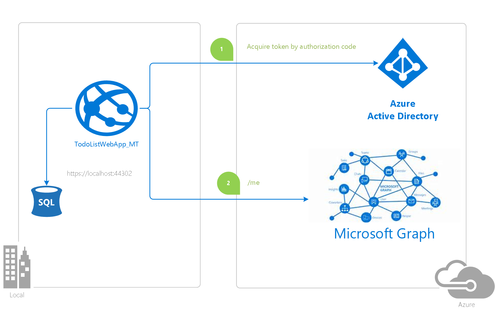
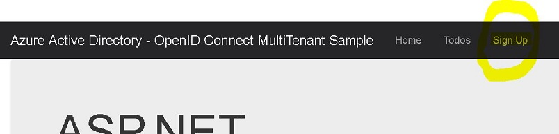
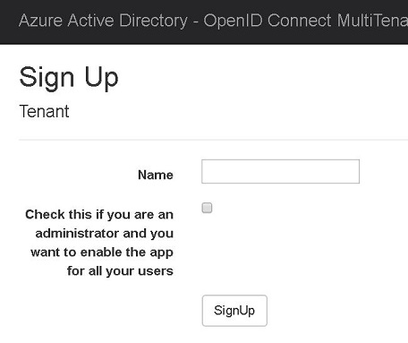
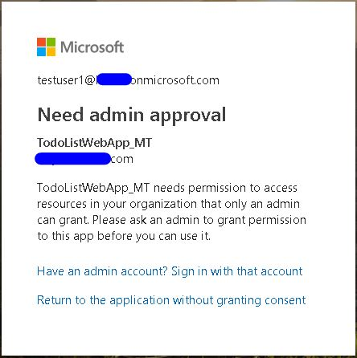
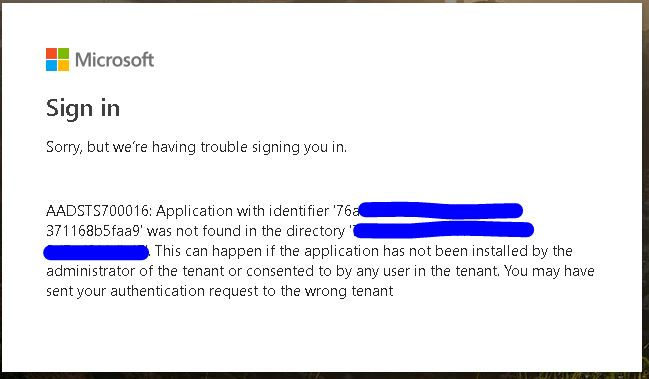

# Build a multi-tenant SaaS web application using Azure AD & OpenID Connect

[](https://identitydivision.visualstudio.com/IDDP/_build/latest?definitionId=729)

## About this sample

This sample shows how to build an ASP.NET MVC web application that uses Azure AD for sign-in using the OpenID Connect protocol. Additionally it also introduces developers to the concept of a [multi-tenant](https://docs.microsoft.com/en-us/azure/active-directory/develop/single-and-multi-tenant-apps) Azure Active Directory application.

### Overview

When it comes to developing apps, developers can choose to configure their app to be either single-tenant or multi-tenant during app registration in the [Azure portal](https://portal.azure.com).

- `Single-tenant` apps are only available in the tenant they were registered in, also known as their home tenant.
- `Multi-tenant` apps are available to users in both their home tenant and other tenants where they are provisioned.

For more information about apps and tenancy, see [Tenancy in Azure Active Directory](https://docs.microsoft.com/en-us/azure/active-directory/develop/single-and-multi-tenant-apps)

This sample shows how to build a [multi-tenant](https://docs.microsoft.com/en-us/azure/active-directory/develop/single-and-multi-tenant-apps) ASP.Net MVC web application that uses [OpenID Connect](https://docs.microsoft.com/en-us/azure/active-directory/develop/v1-protocols-openid-connect-code) to sign up and sign in users from any Azure Active Directory tenant, using the [ASP.Net OpenID Connect OWIN middleware](https://github.com/AzureAD/azure-activedirectory-identitymodel-extensions-for-dotnet) and the [Active Directory Authentication Library (ADAL) for .NET](https://github.com/AzureAD/azure-activedirectory-library-for-dotnet).

> Looking for previous versions of this code sample? Check out the tags on the [releases](../../releases) GitHub page.

For more information about how the protocols work in this scenario and other scenarios, see the [Authentication Scenarios for Azure AD](https://azure.microsoft.com/documentation/articles/active-directory-authentication-scenarios/) document.



### Scenario

This sample demonstrates a multi-tenant .NET Web App (MVC) application signing in users from multiple Azure AD tenants and calling [Microsoft Graph](https://graph.microsoft.com).

1. The web app allows the tenant admins to sign-up (and provision this app in their tenant) by signing them in using the [ASP.Net OpenID Connect OWIN middleware](https://github.com/AzureAD/azure-activedirectory-identitymodel-extensions-for-dotnet).
1. The users of these signed-up tenants can then sign-in themselves and create a Todo list for themselves.
1. The application also uses the [Active Directory Authentication Library (ADAL) for .NET](https://github.com/AzureAD/azure-activedirectory-library-for-dotnet) library to obtain a JWT access token from Azure Active Directory (Azure AD) for [Microsoft Graph](https://graph.microsoft.com).
1. The access token is used as a bearer token to authenticate the user when calling [Microsoft Graph](https://graph.microsoft.com) to fetch the signed-in user's details.

## How to run this sample

To run this sample, you'll need:

- [Visual Studio 2017](https://aka.ms/vsdownload)
- An Internet connection.
- An Azure Active Directory (Azure AD) tenant. For more information on how to get an Azure AD tenant, see [How to get an Azure AD tenant](https://azure.microsoft.com/en-us/documentation/articles/active-directory-howto-tenant/)
- A user account in your Azure AD tenant. This sample will not work with a Microsoft account (formerly Windows Live account). Therefore, if you signed in to the [Azure portal](https://portal.azure.com) with a Microsoft account and have never created a user account in your directory before, you need to do that now.

>[!Note] If you want to run this sample in a **National Cloud**, navigate to the ["National Cloud Deviations"](#national-cloud-deviations) section at the bottom of this page.
>
>
>

### Step 1:  Clone or download this repository

From your shell or command line:

```Shell
git clone https://github.com/Azure-Samples/active-directory-dotnet-webapp-multitenant-openidconnect.git`
```

or download and extract the repository .zip file.

> Given that the name of the sample is pretty long, and so are the name of the referenced NuGet packages, you might want to clone it in a folder close to the root of your hard drive, to avoid file size limitations on Windows.

### Step 2: Register the sample with your Azure Active Directory tenant

There is one project in this sample. To register it, you can:

- either follow the steps in the paragraphs below ([Step 2: Register the sample with your Azure Active Directory tenant](#step-2-register-the-sample-with-your-azure-active-directory-tenant) and [Step 3:  Configure the sample to use your Azure AD tenant](#step-3--configure-the-sample-to-use-your-azure-ad-tenant)
- or use PowerShell scripts that:
  - **automatically** create for you the Azure AD applications and related objects (passwords, permissions, dependencies)
  - modify the Visual Studio project's configuration files.

If you want to use this automation, read the instructions in [App Creation Scripts](./AppCreationScripts/AppCreationScripts.md)

#### Choose the Azure AD tenant where you want to create your applications

As a first step you'll need to:

1. Sign in to the [Azure portal](https://portal.azure.com) using either a work or school account.
1. If your account gives you access to more than one tenant, select your account in the top-right corner, and set your portal session to the desired Azure AD tenant
   (using **Switch Directory**).
1. In the left-hand navigation pane, select the **Azure Active Directory** service, and then select **App registrations (Preview)**.

#### Register the service app (TodoListWebApp_MT)

1. In **App registrations (Preview)** page, select **New registration**.
1. When the **Register an application page** appears, enter your application's registration information:
   - In the **Name** section, enter a meaningful application name that will be displayed to users of the app, for example `TodoListWebApp_MT`.
   - In the **Supported account types** section, select **Accounts in any organizational directory**.
   - In the Redirect URI (optional) section, select **Web** in the combo-box and enter the following redirect URIs.
       - `https://localhost:44302/`
       - `https://localhost:44302/Onboarding/ProcessCode`
1. Select **Register** to create the application.
   - Select **Register** to create the application.
1. On the app **Overview** page, find the **Application (client) ID** value and record it for later. You'll need it to configure the Visual Studio configuration file for this project.
1. In the list of pages for the app, select **Authentication**.
   - In the **Advanced settings** section set **Logout URL** to `https://localhost:44302/Account/EndSession`
   - In the **Advanced settings** | **Implicit grant** section, check  **ID tokens** as this sample requires the [Implicit grant flow](https://docs.microsoft.com/en-us/azure/active-directory/develop/v2-oauth2-implicit-grant-flow) to be enabled to
   sign-in the user, and call an API.
1. Select **Save**.
1. The new customer onboarding process implemented by the sample requires the application to perform an OAuth2 request, which in turn requires to associate a key to the app in your tenant. From the **Certificates & secrets** page, in the **Client secrets** section, choose **New client secret**:

   - Type a key description (of instance `app secret`),
   - Select a key duration of either **In 1 year**, **In 2 years**, or **Never Expires**.
   - When you press the **Add** button, the key value will be displayed, copy, and save the value in a safe location.
   - You'll need this key later to configure the project in Visual Studio. This key value will not be displayed again, nor retrievable by any other means,
     so record it as soon as it is visible from the Azure portal.
1. In the list of pages for the app, select **API permissions**
   - Click the **Add a permission** button and then,
   - Ensure that the **Microsoft APIs** tab is selected
   - In the *Commonly used Microsoft APIs* section, click on **Microsoft Graph**
   - In the **Delegated permissions** section, ensure that the right permissions are checked: **User.Read**, **User.Read.All**. Use the search box if necessary.
   - Select the **Add permissions** button

### Step 3:  Configure the sample to use your Azure AD tenant

In the steps below, "ClientID" is the same as "Application ID" or "AppId".

Open the solution in Visual Studio to configure the projects

#### Configure the service project

1. Open the `TodoListWebApp\Web.Config` file
1. Find the app key `ida:ClientId` and replace the existing value with the application ID (clientId) of the `TodoListWebApp_MT` application copied from the Azure portal.
1. Find the app key `ida:ClientSecret` and replace the existing value with the key you saved during the creation of the `TodoListWebApp_MT` app, in the Azure portal.
1. Find the app key `ida:RedirectUri` and replace the existing value with the base address of the TodoListWebApp_MT project (by default `https://localhost:44302/`).

### Step 4:  [optional] Create an Azure Active Directory test tenant

This sample shows how to take advantage of the consent model in Azure AD to make an application available to any user from any organization with a tenant in Azure AD. To see that part of the sample in action, you need to have access to user accounts from a tenant that is different from the one you used for developing the application. The simplest way of doing that is to create a new directory tenant in your Azure subscription (just navigate to the main Active Directory page in the portal and click Add) and add a few test user accounts.

This step is optional as you can also use accounts from the same directory, but if you do you will not see the consent prompts as the app is already approved.

### Step 5: Run the sample

Clean the solution, rebuild the solution, and run it. The sample implements two distinct tasks: the onboarding of a new customer and regular sign in & use of the application.

#### Sign up

When running the app for the very first time, you'd need to sign-in as an administrator first. Click the `Sign Up` link on the top bar.



You will be presented with a form that simulates an onboarding process. Check the checkbox and  Click the `SignUp` button.



 Now you are going through the [admin consent](https://docs.microsoft.com/en-us/azure/active-directory/develop/howto-convert-app-to-be-multi-tenant#admin-consent) flow. In this flow, the app gets provisioned for all the users in one organization. You'll be transferred to the Azure AD portal. Sign in as the administrator and you'd be presented with the following screen to consent on behalf of all users.


Click `Accept` to provision a [service principal](https://docs.microsoft.com/en-us/azure/active-directory/develop/app-objects-and-service-principals#service-principal-object) of this app in the tenant.
You will be transported back to the app, where your registration will be finalized.

If the app is not provisioned in your tenant by the tenant administrator using the steps laid out above, the sign-up process will result in the following error.



This step uses the `prompt=admin_consent' option provided in the [OAuth 2.0 authorization code grant](https://docs.microsoft.com/en-us/azure/active-directory/develop/v1-protocols-oauth-code#request-an-authorization-code) to provide the administrator an option to consent for the entire tenant.

You can also use the [admin consent endpoint](https://docs.microsoft.com/en-us/azure/active-directory/develop/v2-permissions-and-consent#using-the-admin-consent-endpoint) to provision the app in the chosen tenant.

#### Sign in

Once you signed up, you can either click on the `Todo` tab or the `sign in` link to gain access to the application. Note that if you are selecting **sign in** in the same session in which you signed up, you will automatically sign in with the same account you used for signing up.

If you are signing in during a new session, you will be presented with Azure AD's credentials prompt: sign in using an account compatible with the sign up option you chose earlier (the exact same account if you used user consent, any user form the same tenant if you used admin consent).

If you try to sign-in before the tenant administrator has provisioned the app in the tenant using the `Sign up` link above, you will see the following error.



## National Cloud Deviations

In order to run this sample on a National Cloud, you can follow through the steps above with a few variations:

1. You must register this sample for your Azure AD Tenant in a [National Clouds](https://docs.microsoft.com/en-us/azure/active-directory/develop/authentication-national-cloud) by following [[Step 2]](#step-2-register-the-sample-with-your-azure-active-directory-tenant) above in the National cloud of your choice.
 If you using automation provided via Powershell to create your app, you need to change the [Configure.ps1](./AppCreationScripts/Configure.ps1) and [Cleanup.ps1](./AppCreationScripts/Cleanup.ps1) as instructed below to append the `-AzureEnvironmentName` parameter. The details on this parameter and its possible values are listed in [Connect-AzureAD](https://docs.microsoft.com/en-us/powershell/module/azuread/connect-azuread?view=azureadps-2.0).

 ```Powershell
 Connect-AzureAD -TenantId $tenantId -AzureEnvironmentName AzureUSGovernment

1. Then follow the steps outlined in [[Steps 3]](#step-3--configure-the-sample-to-use-your-azure-ad-tenant) above and additionally make the following changes in the `TodoListWebApp\Web.Config` file.
    - Find the app key `ida:AADInstance` and replace the existing value with the corresponding sign-in endpoint for the national or sovereign cloud you want to target.
    - Find the app key `ida:GraphAPIEndpoint` and replace the existing value with the corresponding Graph endpoint for the  national or sovereign cloud you want to target.
    - Find the app key `ida:IssuerEndpoint` and replace the existing value with the corresponding issuer endpoint for the  national or sovereign cloud you want to target.

Once those changes have been accounted for, you should be able to run this sample in a National Cloud of your choice.  

## About The Code

The application is subdivided in three main functional areas:

1. Common assets
1. Sign up
1. Todo editor

Let's briefly list the noteworthy elements in each area. For more details, please refer to the comments in the code.

### Common assets

The application relies on models defined in Models/AppModels.cs, stored via entities as described by the context and initializer classes in the DAL folder.
The Home controller provides the basis for the main experience, listing all the actions the user can perform and providing conditional UI elements for explicit sign in and sign out (driven by the Account controller).

### Sign Up

The signs up operations are handled by the Onboarding controller.
The SignUp action and corresponding view simulate a simple onboarding experience, which results in an OAuth2 code grant request that triggers the consent flow.
The ProcessCode action receives authorization codes from Azure AD and, if they appear valid (see the code comments for details) it creates entries in the application store for the new customer organization/user.

### Todo editor

This component is the application proper.
Its core resource is the Todo controller, a CRUD editor, which leverages claims and the entity framework to manage a personalized list of Todo items for the currently signed in user.
The Todo controller is secured via OpenId Connect, according to the logic in App_Start/Startup.Auth.cs.

### Notable code:

```CSharp

    TokenValidationParameters = new System.IdentityModel.Tokens.TokenValidationParameters
    {
       ValidateIssuer = false,
    }

```

That code turns off the default Issuer validation, given that in the case of a multitenant app, the list of acceptable [issuer](https://docs.microsoft.com/en-us/azure/active-directory/develop/id-tokens#payload-claims) values is dynamic and cannot be acquired via metadata (as it is instead the case of a single tenant).

```CSharp

    RedirectToIdentityProvider = (context) =>
    {
       string appBaseUrl = context.Request.Scheme + "://" + context.Request.Host + context.Request.PathBase;
       context.ProtocolMessage.Redirect_Uri = appBaseUrl;
       context.ProtocolMessage.Post_Logout_Redirect_Uri = appBaseUrl;
       return Task.FromResult(0);
    }

```

That handler for `RedirectToIdentityProvider` assigns to the `Redirect_Uri` and `Post_Logout_Redirect_Uri` (properties used for sign in and sign out locations) URLs that reflect the current address of the application. This assignment allows you to deploy the app to Azure Web Sites or any other location without having to change hardcoded address settings. You do need to add the intended addresses to the Azure AD entry for your application.

Finally: the implementation of `SecurityTokenValidated` contains the custom caller validation logic, comparing the incoming token with the database of trusted tenants and registered users and interrupting the authentication sequence if a match is not found.

All of the OWIN middleware in this project is created as a part of the open-source [Katana project](https://github.com/aspnet/AspNetKatana/).  You can read more about OWIN [here](http://owin.org).

### Create and publish the `TodoListWebApp_MT` to an Azure Web Site

1. Sign in to the [Azure portal](https://portal.azure.com).
1. Click **Create a resource** in the top left-hand corner, select **Web + Mobile** --> **Web App**, select the hosting plan and region, and give your web site a name, for example, `TodoListWebApp_MT-contoso.azurewebsites.net`.  Click Create Web Site.
1. Choose **SQL Database**, click on "Create a new database", enter `DefaultConnection` as the **DB Connection String Name**.
1. Select or create a database server, and enter server login credentials.
1. Once the web site is created, click on it to manage it.  For this set of steps, download the publish profile by clicking **Get publish profile** and save it.  Other deployment mechanisms, such as from source control, can also be used.
1. Switch to Visual Studio and go to the TodoListWebApp_MT project.  Right click on the project in the Solution Explorer and select **Publish**.  Click **Import Profile** on the bottom bar, and import the publish profile that you downloaded earlier.
1. Click on **Settings** and in the `Connection tab`, update the Destination URL so that it is https, for example [https://TodoListWebApp_MT-contoso.azurewebsites.net](https://TodoListWebApp_MT-contoso.azurewebsites.net). Click Next.
1. On the Settings tab, make sure `Enable Organizational Authentication` is NOT selected.  Click **Save**. Click on **Publish** on the main screen.
1. Visual Studio will publish the project and automatically open a browser to the URL of the project.  If you see the default web page of the project, the publication was successful.

### Update the Active Directory tenant application registration for `TodoListWebApp_MT`

1. Navigate to the [Azure portal](https://portal.azure.com).
1. On the top bar, click on your account and under the **Directory** list, choose the Active Directory tenant containing the `TodoListWebApp_MT` application.
1. On the applications tab, select the `TodoListWebApp_MT` application.
1. In the **Settings** | page for your application, update the Logout URL fields with the address of your service, for example [https://TodoListWebApp_MT-contoso.azurewebsites.net](https://TodoListWebApp_MT-contoso.azurewebsites.net)
1. From the *Settings -> Properties* menu, update the **Home page URL**, to the address of your service, for example [https://TodoListWebApp_MT-contoso.azurewebsites.net](https://TodoListWebApp_MT-contoso.azurewebsites.net). Save the configuration.
1. Add the same URL in the list of values of the *Settings -> Reply URLs* menu

## Community Help and Support

Use [Stack Overflow](http://stackoverflow.com/questions/tagged/adal) to get support from the community.
Ask your questions on Stack Overflow first and browse existing issues to see if someone has asked your question before.
Make sure that your questions or comments are tagged with [`adal` `msal` `dotnet`].

If you find a bug in the sample, please raise the issue on [GitHub Issues](../../issues).

To provide a recommendation, visit the following [User Voice page](https://feedback.azure.com/forums/169401-azure-active-directory).

## Contributing

If you'd like to contribute to this sample, see [CONTRIBUTING.MD](/CONTRIBUTING.md).

This project has adopted the [Microsoft Open Source Code of Conduct](https://opensource.microsoft.com/codeofconduct/). For more information, see the [Code of Conduct FAQ](https://opensource.microsoft.com/codeofconduct/faq/) or contact [opencode@microsoft.com](mailto:opencode@microsoft.com) with any additional questions or comments.

## More information

For more information, see the following links:

- [Tenancy in Azure Active Directory](https://docs.microsoft.com/en-us/azure/active-directory/develop/single-and-multi-tenant-apps)
- [Understanding Azure AD application consent experiences](https://docs.microsoft.com/en-us/azure/active-directory/develop/application-consent-experience)
- [How to: Sign in any Azure Active Directory user using the multi-tenant application pattern](https://docs.microsoft.com/en-us/azure/active-directory/develop/howto-convert-app-to-be-multi-tenant)
- [Understand user and admin consent](https://docs.microsoft.com/en-us/azure/active-directory/develop/howto-convert-app-to-be-multi-tenant#understand-user-and-admin-consent)
- [Application and service principal objects in Azure Active Directory](https://docs.microsoft.com/en-us/azure/active-directory/develop/app-objects-and-service-principals)
- [Quickstart: Register an application with the Microsoft identity platform (Preview)](https://docs.microsoft.com/azure/active-directory/develop/quickstart-register-app)
- [Quickstart: Configure a client application to access web APIs (Preview)](https://docs.microsoft.com/azure/active-directory/develop/quickstart-configure-app-access-web-apis)
- [Recommended pattern to acquire a token](https://github.com/AzureAD/azure-activedirectory-library-for-dotnet/wiki/AcquireTokenSilentAsync-using-a-cached-token#recommended-pattern-to-acquire-a-token)
- [Customizing Token cache serialization](https://github.com/AzureAD/azure-activedirectory-library-for-dotnet/wiki/Token-cache-serialization)
- [National Clouds](https://docs.microsoft.com/en-us/azure/active-directory/develop/authentication-national-cloud)
- [ADAL.NET's conceptual documentation](https://github.com/AzureAD/azure-activedirectory-library-for-dotnet/wiki)

For more information about how OAuth 2.0 protocols work in this scenario and other scenarios, see [Authentication Scenarios for Azure AD](http://go.microsoft.com/fwlink/?LinkId=394414).
